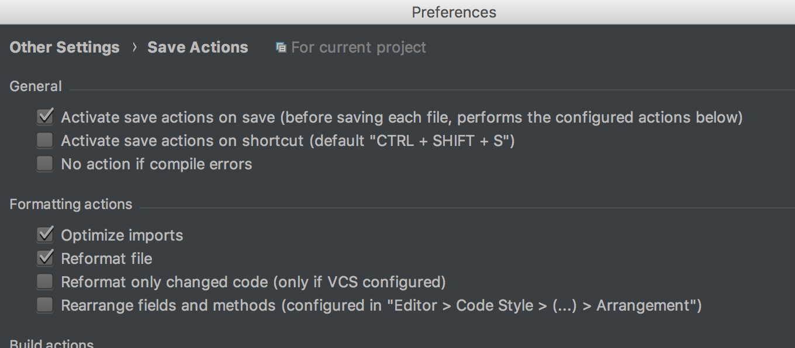

## Java code styles

IntelliJ IDEA code style settings

### Install
 * Clone repo
 
 * Modify permissions for the shell script `install.sh`
 
   `$ chmod +x install.sh`
 
 * Run the script
   `./install.sh`

### Apply
 * Preferences > Plugins > Search plugin "Save Actions" > Install
 * Restart Intellij IDEA
 * Preferences > Editor > Codestyle and apply scheme 'JavaDev'
 

Note: Save Actions [How to](https://stackoverflow.com/questions/946993/intellij-reformat-on-file-save)

Apply: 

